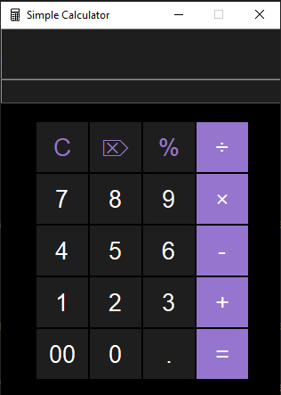
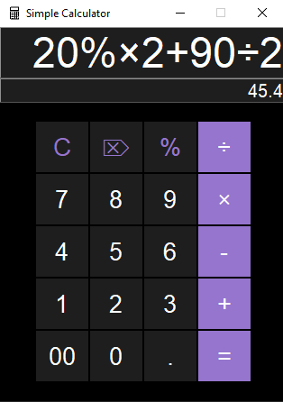

## 🖥️ Simple Calculator with Tkinter

This is a simple calculator GUI app built using Python's Tkinter library. It performs basic arithmetic operations such as addition, subtraction, multiplication, division, percentage calculations, and includes clear functionalities.

## 📌 About the Project

This project is just an idea of mine to challenge my self more and gain more knowledge about Python Tkinter. This is also my Second Project so thankyou for checking it out!

## 🚀 Features
- Clean and simple interface

- Basic arithmetic operations: +, -, ×, ÷, %

- Entry correction: ⌦ deletes the last character

- Full reset: C clears all entries

- Decimal support: .

- Double zero input: 00

- Result evaluation with =

## 📸 Screenshots

## 🛠️ Tech Stack

Language: Python🐍

GUI Library: Tkinter (built-in with Python)
